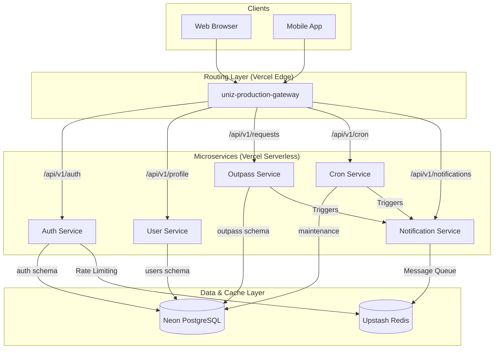

# 🏗️ UniZ Microservices Architecture

Detailed architectural overview of the UniZ platform, including service interaction, data flow, and deployment infrastructure.

## 📊 System Architecture Diagram

## 🚀 Service Directory

| Service | Primary Responsibility | Database / Schema |
| :--- | :--- | :--- |
| **Auth Service** | Identity management, JWT generation, OTP verification | Neon / `auth` |
| **User Service** | Student profiles, Faculty records, Role management | Neon / `users` |
| **Outpass Service** | Outpass request workflow, Approval logic | Neon / `outpass` |
| **Cron Service** | Expiring old outpasses, Database maintenance | Neon (Shared) |
| **Notification Service** | Sending emails, Handling background job queues | Upstash Redis |
| **Shared Lib** | Common Zod schemas, Types, and Error codes | N/A (Inlined) |

## 🛠️ Technology Stack

- **Framework**: Node.js / Express.js / TypeScript
- **Database**: Neon (Serverless PostgreSQL)
- **ORM**: Prisma
- **Cache/Queue**: Upstash Redis / BullMQ
- **Hosting**: Vercel (Edge & Serverless)
- **API Gateway**: Vercel Rewrites (Low Latency)

## 📡 Production Endpoints

- **Root Gateway**: `https://uniz-production-gateway.vercel.app/api/v1`
- **Frontend App**: `https://uniz-ten.vercel.app`

---

*Generated by UniZ Infra Automation*
